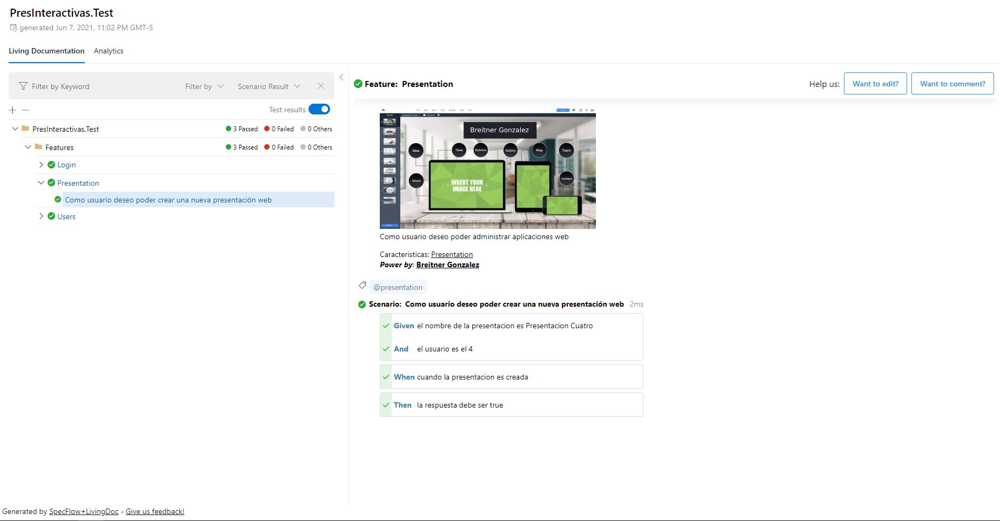

# Presentaciones Interactivas

Proyecto para la gestión de presentaciones Web Interactivas.

## Caracteristicas

Proyecto desarrollado en [.NET 5.0](https://dotnet.microsoft.com/download/dotnet/5.0) y [SpecFlow](https://specflow.org/) para la ejecución de pruebas automatizadas y BDD.

## Ejecución

Para la ejecución del proyecto es necesario tener instalado .NET 5.0 y haberse registrado en [SpecFlow+LivingDoc](https://docs.specflow.org/projects/specflow-livingdoc/en/latest/?utm_source=html&utm_medium=footer&utm_campaign=livingdoc_generator).

### Los pasos de ejecución son:

1. *Compilar y subir imagen de Docker a [docker hub](https://hub.docker.com/):*

**Compilar:**

    ~]$ docker build -t imagen:etiqueta .

**Subir:**

    ~]$ docker push imagen:etiqueta

2. *Compilar y ejecutar con dotnet:*

**Compilar:**

    ~]$ dotnet build

**Ejecutar Proyecto:**

    ~]$ dotnet run

**Ejecutar Pruebas:**
Con la ejecución de las pruebas el resultado de estas pruebas se ven reflejadas en la carpeta "TestResults"

    ~]$ dotnet test
## Login 

## Users

## Presentations
